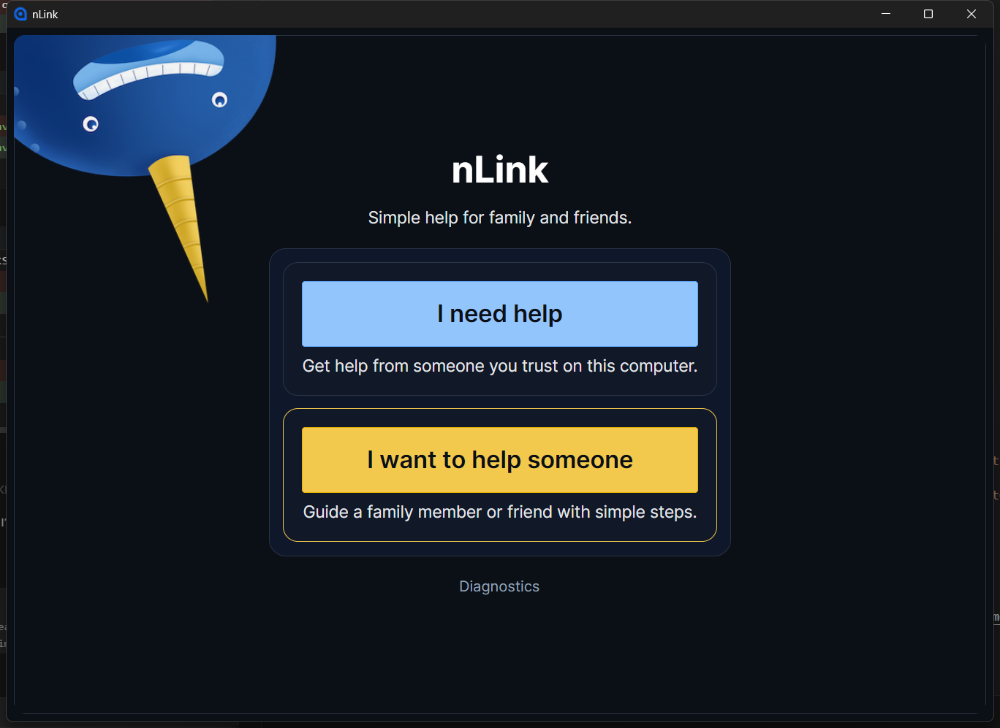
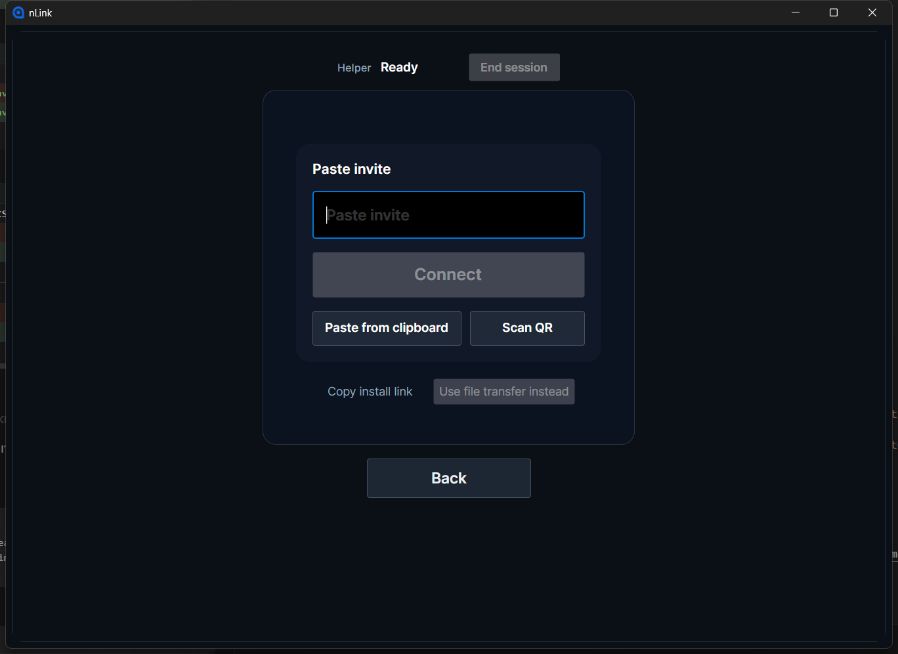
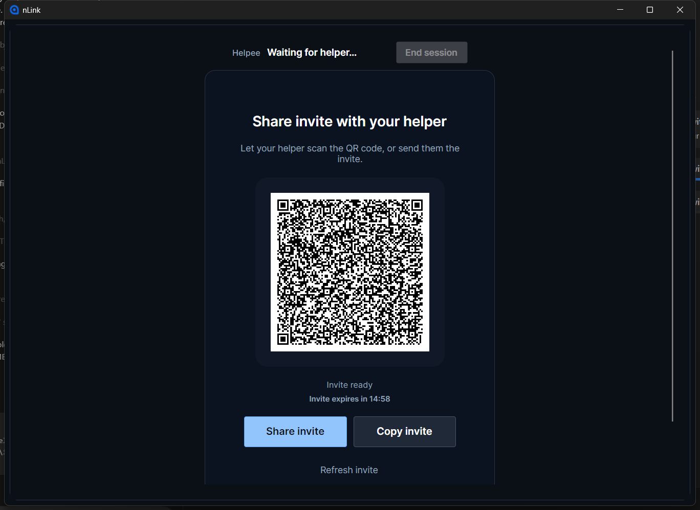

# nLink

nLink is a private, secure, serverless, simple screen sharing application for helping family and friends. No accounts needed.

Powered by NKN. Official website: https://nkn.org/

Minimal `.NET 8` / Avalonia desktop app (Windows-first) with deterministic smoke tests.

## Current Release (0.4.0)

`0.4.0` is the current stabilized release. It introduces invite-based connection as the primary flow.

- Helpee shares an invite with QR, share, and copy actions.
- Helper connects by pasting an invite, pasting from the clipboard, or scanning a QR code.

## Quick Start (Windows)

1. Go to the GitHub Releases page and download the Installer (recommended) or Portable ZIP.
2. Helpee opens nLink, clicks `I need help`, and shares the invite.
3. Helper opens nLink, clicks `I want to help`, pastes the invite or scans the QR code, and clicks `Connect`.
4. Helpee clicks `Allow`.
5. Chat opens on both sides.

Home:

Helper:

Helpee:

If connection fails:
Open Diagnostics -> Copy diagnostics and include it when reporting issues.

Notes:
- Windows x64 only
- Current release (`0.4.0`)
- Installer path: `%LOCALAPPDATA%\Programs\nLink Helper`

Versioning:
- Release version uses SemVer (for example: `0.4.0`)
- The current release version is stored in the repo-root `VERSION` file

License:
- MIT (see `LICENSE`)

## Build from source (developers)

### How to run

1. Restore dependencies:
   `dotnet restore`
2. Run the desktop app:
   `dotnet run --project src/nLink.App`

### How to build

1. Build the solution:
   `dotnet build`

### Tests

- Run all tests:
  `dotnet test`
- Run deterministic smoke tests (always available):
  `dotnet test -c Release --filter Category=Smoke`

### Release Validation (Maintainers, Windows)

- Recommended full pre-release automation (tests + packaging):
  `powershell -ExecutionPolicy Bypass -File .\tools\PreRelease-Check.ps1 -RunFormatCheck -RunBetaReadiness`
- Optional GUI smoke (interactive desktop session required):
  `powershell -ExecutionPolicy Bypass -File .\tools\PreRelease-Check.ps1 -RunGuiSmoke -RunFormatCheck -RunBetaReadiness`
- Output release assets:
  `artifacts/releases/<version>/nLink-Portable-win-x64-<version>.zip`
  `artifacts/releases/<version>/nLink-Setup-win-x64-<version>.exe`
- Final release notes:
  [`docs/releases/0.4.0.md`](docs/releases/0.4.0.md)
- Screenshare RC/final validation checklist:
  [`docs/release/0.3.0-rc-validation-checklist.md`](docs/release/0.3.0-rc-validation-checklist.md)
- Promotion criteria:
  [`docs/release/0.3.0-promotion.md`](docs/release/0.3.0-promotion.md)
- Optional beta hardening extras (offline/permissions/installer upgrade rollback/hang checks):
  see `docs/BETA_HARDENING_EXTRAS.md`

### Dead-Code Report (Local, Non-Destructive)

- Generate a warning-based dead-code candidate report:
  `powershell -ExecutionPolicy Bypass -File .\tools\DeadCode-Report.ps1`
- Output:
  `artifacts/deadcode/report.md`

### Resource Footprint Tools

- Resource benchmark (idle/connect/idle/disconnect/idle, writes JSON + summary):
  `dotnet run --project src/nLink.App -c Release -- --resource-bench --transport devlocal`
- Leak check (cycle-based growth check, writes JSON + summary):
  `dotnet run --project src/nLink.App -c Release -- --leak-check --cycles 200 --transport devlocal`
- Enable resource gate failure (threshold + growth checks):
  add `--fail-on-gate`
- ResourceGate threshold overrides (examples):
  `--resource-growth-warn-percent 10 --resource-growth-fail-percent 20`
  `--app-working-set-max-mb 1024 --app-private-bytes-max-mb 1024 --app-thread-max 400 --app-handle-max 20000 --app-cpu-idle-avg-max-pct 40`
  `--bridge-working-set-max-mb 512 --bridge-private-bytes-max-mb 512 --bridge-thread-max 300 --bridge-handle-max 20000 --bridge-cpu-idle-avg-max-pct 40 --resource-fail-on-bridge-thresholds`
- LeakCheck growth threshold override:
  `--leak-growth-fail-percent 20`
- Pre-release helpers:
  `powershell -ExecutionPolicy Bypass -File .\tools\PreRelease-Check.ps1 -RunResources -RunLeakCheck`

### Building Portable EXE (ZIP Release)

Portable releases are built from one canonical folder, then optionally copied into helper/helpee alias folders.

1. Build the canonical portable folder + ZIP:
   `powershell -ExecutionPolicy Bypass -File .\installer\Build-Portable.ps1`

Outputs:
- Canonical portable folder:
  `artifacts/portable/nLink/win-x64`
- Portable ZIP (share this):
  `artifacts/portable/nLink-Portable-win-x64-<version>.zip`

Optional alias copies (same app contents, different folders for workflow convenience):
- Helper alias:
  `powershell -ExecutionPolicy Bypass -File .\installer\Build-Portable.ps1 -CopyHelperAlias`
- Helpee alias:
  `powershell -ExecutionPolicy Bypass -File .\installer\Build-Portable.ps1 -CopyHelpeeAlias`

Notes:
- This is a portable folder build zipped for sharing (not a single-file EXE).
- The main executable is `nLink.exe` inside the folder/zip contents.
- The portable ZIP includes the bundled NKN bridge runtime by default (requires `artifacts/bridge/win-x64` to exist first).
- If the bridge bundle is missing, build it first:
  `powershell -ExecutionPolicy Bypass -File .\installer\Build-BridgeBundle.ps1`

### Building Installer

Minimal installer option (Inno Setup 6), split into two steps:

1. Build the bridge bundle artifact (requires Node.js on the build machine):
   `powershell -ExecutionPolicy Bypass -File .\installer\Build-BridgeBundle.ps1`
2. Install Inno Setup 6 (needs `ISCC.exe` on your machine).
3. Run the installer build script (does not require Node.js/npm):
   `powershell -ExecutionPolicy Bypass -File .\installer\Build-Installer.ps1`

What the script does:
- Builds the canonical portable folder + ZIP (via `installer/Build-Portable.ps1`)
- Copies the canonical portable build into helper staging:
  `artifacts/portable/helper/win-x64`
- Requires and validates the prebuilt bridge bundle artifact:
  `artifacts/bridge/win-x64`
- Copies the bridge bundle into helper staging under:
  `artifacts/portable/helper/win-x64/bridge/win-x64`
- Builds an installer to:
  `artifacts/installer`
  (filename: `nLink-Setup-win-x64-<version>.exe`)

Notes:
- If Inno Setup is not installed, the script still builds the portable helper folder and then prints a clear message.
- The installer is a simple per-user install (`LocalAppData\Programs\nLink Helper`) to avoid admin prompts.
- If `artifacts/bridge/win-x64/` is missing, installer build stops with:
  `Bridge runtime not found. Run the bridge bundle build step first.`

### Bundled NKN Bridge Runtime (No Node Install Needed on End User PC)

Canonical bridge bundle artifact (built in Step 1):

- `artifacts/bridge/win-x64/node.exe`
- `artifacts/bridge/win-x64/index.js`
- `artifacts/bridge/win-x64/package.json`
- `artifacts/bridge/win-x64/node_modules/...` (including `nkn-sdk`)

The installer step copies this artifact into the helper app output/install, so the end user does not need Node.js installed.

Bundled runtime location inside the app output/install (required Release layout):

- `bridge/win-x64/node.exe`
- `bridge/win-x64/index.js`
- `bridge/win-x64/package.json`
- `bridge/win-x64/node_modules/...`

Runtime behavior:
- `Release` builds prefer the bundled bridge runtime (`bridge/<rid>/node(.exe)` + `bridge/<rid>/index.js`)
- `Debug` builds allow launching `node` from `PATH` for local development

Advanced overrides (optional):
- `NLINK_NKN_NODE_PATH`
- `NLINK_NKN_BRIDGE_PATH`

### Manual NKN Integration Test (Not CI)

Use this only as a manual test. Do not add CI tests that depend on real NKN connectivity.

Setup:
1. Enable NKN transport:
   `set NLINK_TRANSPORT=NKN`
2. (Optional) Set a seed RPC endpoint:
   `set NLINK_NKN_SEED_RPC=<rpc-host:port>`

Run the test (same PC, two app instances):
1. Start the first app instance:
   `dotnet run --project src/nLink.App -c Release`
2. Click `I need help`
3. Copy the invite shown on screen
4. Start the second app instance:
   `dotnet run --project src/nLink.App -c Release`
5. Click `I want to help someone`
6. Paste the invite
7. Click `Connect`
8. On the first instance, click `Allow`
9. Send chat messages both ways and confirm they appear on both sides

If it fails (copy diagnostics):
1. In the app, open `Diagnostics`
2. Click `Copy diagnostics`
3. Include the copied text when reporting the issue

### Chat (E2E) over NKN transport

nLink includes a simple 1:1 in-session chat (message list + text box + Send button).

How it works at a high level:
- Chat works separately from screen sharing, so you can use it right away.
- Messages are protected end-to-end before they are sent.
- The app creates a temporary chat key for each session during the connection approval step.
- Chat messages travel through the selected connection transport (`DevLocal` for same-PC testing, `NKN` for internet connection).
- Message text is not written to logs.
