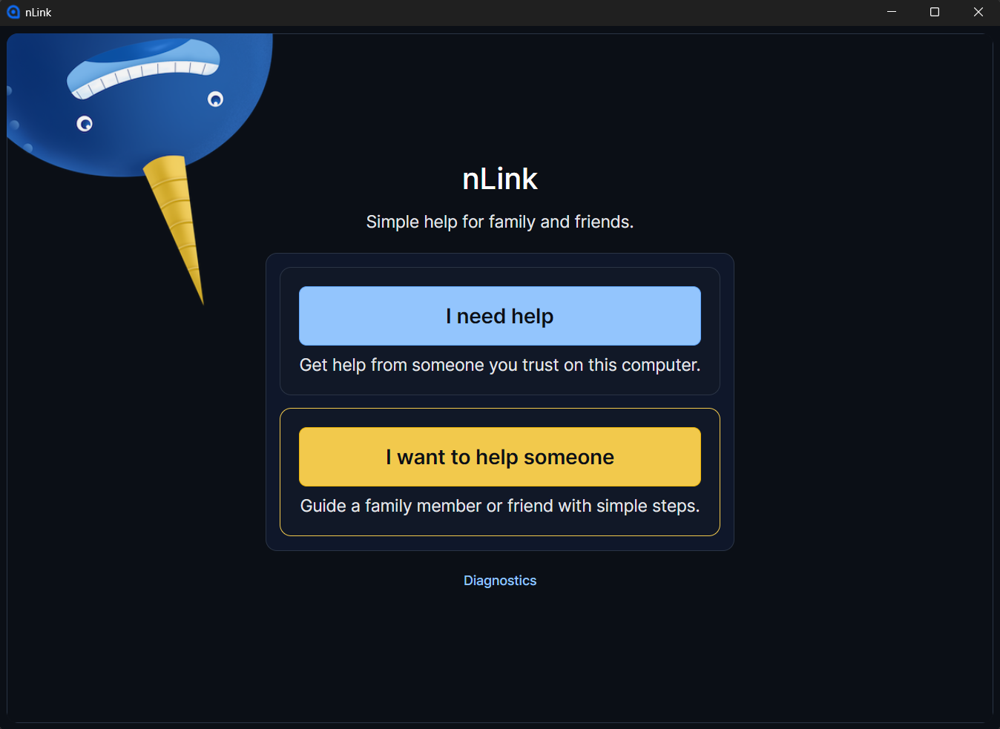
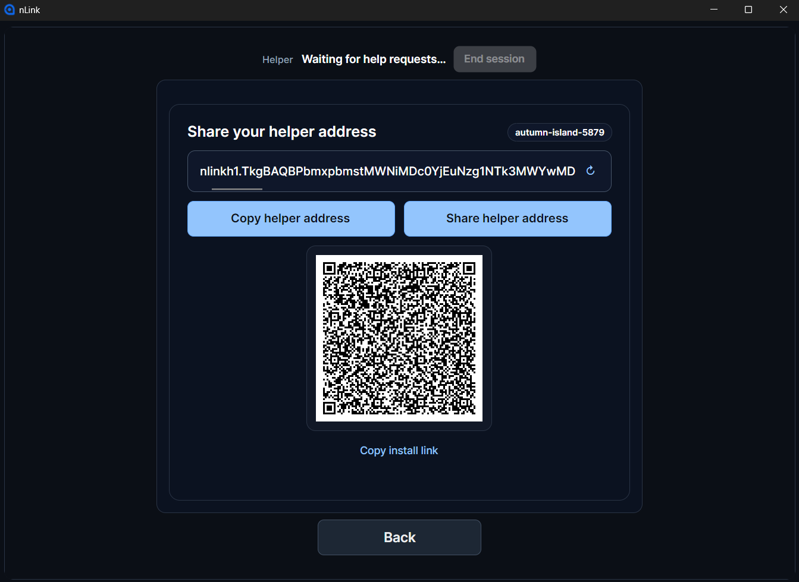
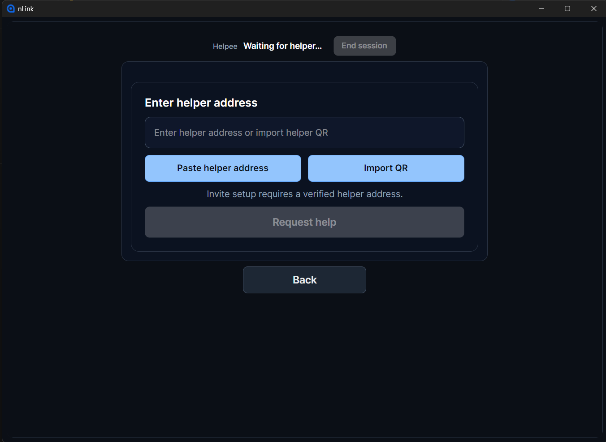
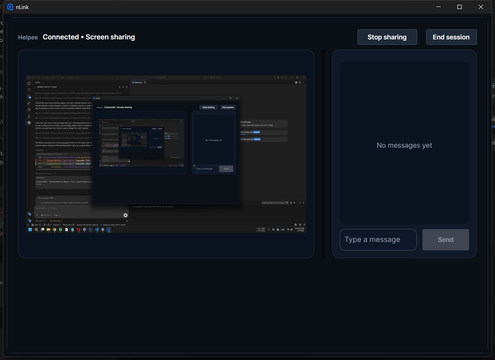
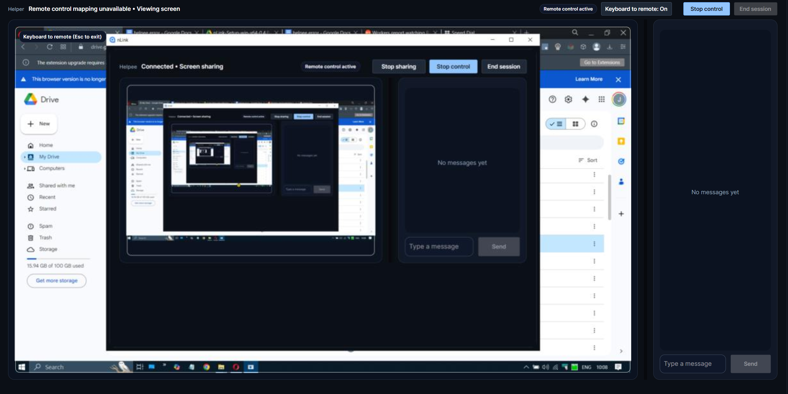

# nLink

nLink is a private, serverless, simple screen sharing application for helping family and friends. No accounts needed.

Created by Codex/GPT

Powered by NKN. Official website: https://nkn.org/

Minimal `.NET 8` / Avalonia desktop app (Windows-first) with deterministic smoke tests.

## Current Release (0.6.2)

`0.6.2` is the current release. It keeps the H.264 screen-sharing default from the prior release, and focuses on file-transfer reliability, session approval clarity, connection lifecycle recovery, and chat usability while screen sharing.

## Quick Start (Windows)

1. Go to the GitHub Releases page and download the Installer (recommended) or Portable ZIP.
2. Helper opens nLink, clicks `I want to help`, and copies the helper address.
3. Helpee opens nLink, clicks `I need help`, enters the provided helper address, and clicks `Request help`.
4. Helper receives the incoming help request and clicks `Accept`.
5. Both sides compare the session verification symbols, then Helpee clicks `Allow`.
6. Chat opens on both sides.
7. If `Transfer files` is allowed for the session, either side can click `Send file`.

Home:

Helper:

Helpee:

Screen sharing:

Remote control:

If connection fails:
Open Diagnostics -> Copy diagnostics and include it when reporting issues. If a screenshare soak artifact has already been analyzed, Diagnostics includes a compact screenshare evidence summary; for hangs or freezes, use Diagnostics -> Save Hang Report. See [`docs/supportability.md`](docs/supportability.md) for the support evidence checklist.

For release-safe builds, Diagnostics should show:
- `invite_security_mode: issued_one_time_secret_invites`
- `invite_public_flow: verified_helper_required`
- `invite_security_release_ready: Yes`
- `invite_security_warning: none`

Normal release UX uses a raw helper address and an approval-time session verification sequence, then a direct helpee-side `Request help` flow with QR/share/copy support where needed. The approval check is a compact five-symbol comparison on both screens.

Notes:
- Windows x64 only
- Current release (`0.6.2`)
- Default screensharing uses H.264 video transport, with helper-side recovery protection for broken reference chains.
- Advanced Diagnostics includes Balanced, High quality, and High performance screen-share presets.
- The helper-side cursor overlay, H.264 motion/keyframe safeguards, WGC GPU scaling, and same-apartment Win10 WGC teardown remain enabled.
- Chat UX keeps `Enter` to send, `Shift+Enter` for a new line, stable pane sizing in chat-only and screen-sharing layouts, and message entry remains available during screen sharing.
- File transfer in `0.6.2` is V4-only and single-file only. No folders, drag-and-drop, or resume after restart yet.
- Receiving a file requires explicit accept/decline, and file-transfer data is protected by nLink's session envelope plus source/session validation rather than by assuming NKN transport alone is sufficient.
- Active file transfers can be paused, resumed, or canceled from either side when file transfer is allowed.
- Received files are saved into the Windows Downloads folder by default, with a numbered suffix added automatically when the target name already exists.
- Safe-by-default file size cap for `0.6.2`: `25 GiB`
- Large file transfers over NKN can still be noticeably slower than local or direct network copy. Live screenshare latency can also vary with NKN/network delivery.
- Release exception: Windows artifacts for `0.6.2` are unsigned; verify downloads with `SHA256SUMS.txt`.
- Installer path: `%LOCALAPPDATA%\Programs\nLink`

License:
- MIT (see `LICENSE`)

## Documentation

- Current docs index:
  [`docs/README.md`](docs/README.md)
- Support evidence guide:
  [`docs/supportability.md`](docs/supportability.md)
- Test lane matrix:
  [`docs/test-lanes.md`](docs/test-lanes.md)
- Screenshare operator guide:
  [`docs/screenshare-operability.md`](docs/screenshare-operability.md)

## Build from source (developers)

### How to run

1. Restore dependencies:
   `dotnet restore`
2. Run the desktop app:
   `dotnet run --project src/nLink.App`

### How to build

1. Build the solution:
   `dotnet build`

### Tests

- Run all domain ownership lanes:
  `powershell -ExecutionPolicy Bypass -File .\tools\Test-Lanes.ps1 -Lane Core,Gui,ScreenShare,RemoteControl,Contracts`
- Run deterministic release smoke tests:
  `powershell -ExecutionPolicy Bypass -File .\tools\Test-Lanes.ps1 -Lane Smoke -Configuration Release`
- See the lane matrix:
  [`docs/test-lanes.md`](docs/test-lanes.md)
- For screenshare validation and support flow selection:
  `powershell -ExecutionPolicy Bypass -File .\tools\ScreenShare-Ops.ps1 -Mode Test`
  [`docs/screenshare-operability.md`](docs/screenshare-operability.md)

### Release Validation (Maintainers, Windows)

- Recommended full pre-release automation (tests + packaging):
  `powershell -ExecutionPolicy Bypass -File .\tools\PreRelease-Check.ps1 -RunFormatCheck -RunBetaReadiness`
- Optional GUI smoke (interactive desktop session required):
  `powershell -ExecutionPolicy Bypass -File .\tools\PreRelease-Check.ps1 -RunGuiSmoke -RunFormatCheck -RunBetaReadiness`
- Output release assets:
  `artifacts/releases/<version>/nLink-Portable-win-x64-<version>.zip`
  `artifacts/releases/<version>/nLink-Setup-win-x64-<version>.exe`
- Final release notes:
  [`docs/releases/0.6.2.md`](docs/releases/0.6.2.md)
- GitHub release body:
  [`docs/releases/0.6.2-github.md`](docs/releases/0.6.2-github.md)
- RC/final validation checklist:
  [`docs/release/rc-validation-checklist.md`](docs/release/rc-validation-checklist.md)

### Dead-Code Report (Local, Non-Destructive)

- Generate a warning-based dead-code candidate report:
  `powershell -ExecutionPolicy Bypass -File .\tools\DeadCode-Report.ps1`
- Output:
  `artifacts/deadcode/report.md`

### Resource Footprint Tools

- Resource benchmark (idle/connect/idle/disconnect/idle, writes JSON + summary):
  `dotnet run --project src/nLink.App -c Release -- --resource-bench --transport devlocal`
- Leak check (cycle-based growth check, writes JSON + summary):
  `dotnet run --project src/nLink.App -c Release -- --leak-check --cycles 200 --transport devlocal`
- Enable resource gate failure (threshold + growth checks):
  add `--fail-on-gate`
- ResourceGate threshold overrides (examples):
  `--resource-growth-warn-percent 10 --resource-growth-fail-percent 20`
  `--app-working-set-max-mb 1024 --app-private-bytes-max-mb 1024 --app-thread-max 400 --app-handle-max 20000 --app-cpu-idle-avg-max-pct 40`
  `--bridge-working-set-max-mb 512 --bridge-private-bytes-max-mb 512 --bridge-thread-max 300 --bridge-handle-max 20000 --bridge-cpu-idle-avg-max-pct 40 --resource-fail-on-bridge-thresholds`
- LeakCheck growth threshold override:
  `--leak-growth-fail-percent 20`
- Pre-release helpers:
  `powershell -ExecutionPolicy Bypass -File .\tools\PreRelease-Check.ps1 -RunResources -RunLeakCheck`

### Building Portable EXE (ZIP Release)

Portable releases are built from one canonical folder, then optionally copied into helper/helpee alias folders.

1. Build the canonical portable folder + ZIP:
   `powershell -ExecutionPolicy Bypass -File .\installer\Build-Portable.ps1`

Outputs:
- Canonical portable folder:
  `artifacts/portable/nLink/win-x64`
- Portable ZIP (share this):
  `artifacts/portable/nLink-Portable-win-x64-<version>.zip`

Optional alias copies (same app contents, different folders for workflow convenience):
- Helper alias:
  `powershell -ExecutionPolicy Bypass -File .\installer\Build-Portable.ps1 -CopyHelperAlias`
- Helpee alias:
  `powershell -ExecutionPolicy Bypass -File .\installer\Build-Portable.ps1 -CopyHelpeeAlias`

Notes:
- This is a portable folder build zipped for sharing (not a single-file EXE).
- The main executable is `nLink.exe` inside the folder/zip contents.
- The portable ZIP includes the bundled NKN bridge runtime by default (requires `artifacts/bridge/win-x64` to exist first).
- If the bridge bundle is missing, build it first:
  `powershell -ExecutionPolicy Bypass -File .\installer\Build-BridgeBundle.ps1`

### Building Installer

Minimal installer option (Inno Setup 6), split into two steps:

1. Build the bridge bundle artifact (requires Node.js on the build machine):
   `powershell -ExecutionPolicy Bypass -File .\installer\Build-BridgeBundle.ps1`
2. Install Inno Setup 6 (needs `ISCC.exe` on your machine).
3. Run the installer build script (does not require Node.js/npm):
   `powershell -ExecutionPolicy Bypass -File .\installer\Build-Installer.ps1`

What the script does:
- Builds the canonical portable folder + ZIP (via `installer/Build-Portable.ps1`)
- Copies the canonical portable build into helper staging:
  `artifacts/portable/helper/win-x64`
- Requires and validates the prebuilt bridge bundle artifact:
  `artifacts/bridge/win-x64`
- Copies the bridge bundle into helper staging under:
  `artifacts/portable/helper/win-x64/bridge/win-x64`
- Builds an installer to:
  `artifacts/installer`
  (filename: `nLink-Setup-win-x64-<version>.exe`)

Notes:
- If Inno Setup is not installed, the script still builds the portable helper folder and then prints a clear message.
- The installer is a simple per-user install (`LocalAppData\Programs\nLink`) to avoid admin prompts.
- If `artifacts/bridge/win-x64/` is missing, installer build stops with:
  `Bridge runtime not found. Run the bridge bundle build step first.`

### Bundled NKN Bridge Runtime (No Node Install Needed on End User PC)

Canonical bridge bundle artifact (built in Step 1):

- `artifacts/bridge/win-x64/node.exe`
- `artifacts/bridge/win-x64/index.js`
- `artifacts/bridge/win-x64/package.json`
- `artifacts/bridge/win-x64/node_modules/...` (including `nkn-sdk`)

The installer step copies this artifact into the helper app output/install, so the end user does not need Node.js installed.

Bundled runtime location inside the app output/install (required Release layout):

- `bridge/win-x64/node.exe`
- `bridge/win-x64/index.js`
- `bridge/win-x64/package.json`
- `bridge/win-x64/node_modules/...`

Runtime behavior:
- `Release` builds prefer the bundled bridge runtime (`bridge/<rid>/node(.exe)` + `bridge/<rid>/index.js`)
- `Debug` builds allow launching `node` from `PATH` for local development

Advanced overrides (developer/test only):
- `NLINK_NKN_NODE_PATH`
- `NLINK_NKN_BRIDGE_PATH`

In `Release` builds, unsafe transport, bridge path, NKN topology/recovery, file-transfer tuning, unsafe media, and release-link environment/appsettings overrides are ignored unless `NLINK_UNSAFE_DEVELOPER_MODE=1` is set for that developer test process. Public release validation should use the bundled bridge/runtime and keep the operator shell free of unsafe override variables.

### Manual NKN Integration Test (Not CI)

Use this only as a manual test. Do not add CI tests that depend on real NKN connectivity.

Setup:
1. Enable NKN transport:
   `set NLINK_TRANSPORT=NKN`
2. (Optional) Set a seed RPC endpoint:
   `set NLINK_UNSAFE_DEVELOPER_MODE=1`
   `set NLINK_NKN_SEED_RPC=<rpc-host:port>`

Run the test (same PC, two app instances):
1. Start the first app instance:
   `dotnet run --project src/nLink.App -c Release`
2. Click `I need help`
3. Copy the helper address from the helper screen, enter that helper address on the helpee screen, and share or copy the invite shown on screen
4. Start the second app instance:
   `dotnet run --project src/nLink.App -c Release`
5. Click `I want to help someone`
6. Paste the invite
7. Click `Connect`
8. Compare the session verification symbols on both screens, then on the first instance click `Allow`
9. Send chat messages both ways and confirm they appear on both sides

If it fails (copy diagnostics):
1. In the app, open `Diagnostics`
2. Click `Copy diagnostics`
3. Include the copied text when reporting the issue
